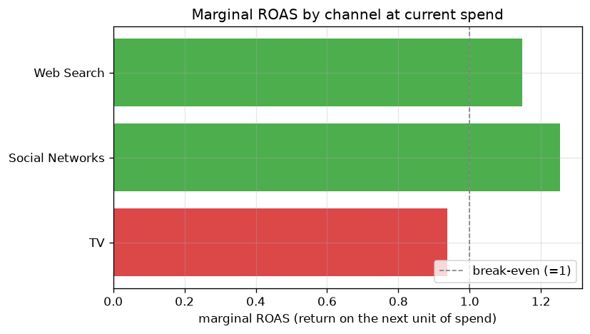
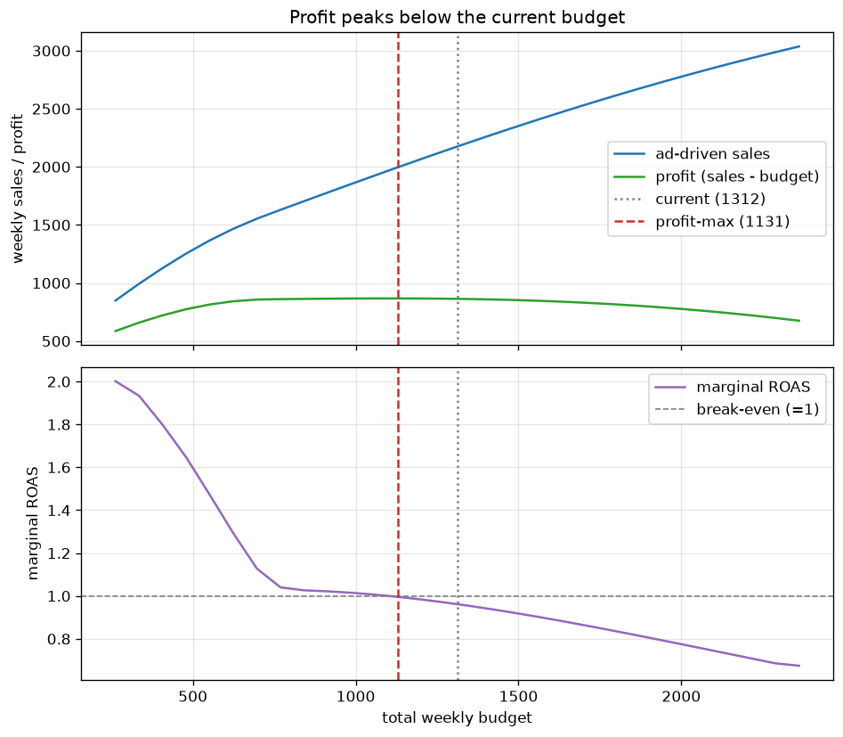

# Budget optimization

Once the model knows how each channel responds to spend, two questions follow:
how to split a fixed budget across channels, and how big the total budget should
be. Both build on [saturation](concepts.md#saturation-diminishing-returns):
because each channel's returns flatten out, the answers are not obvious.

## The response curve

For a steady weekly spend `s` in a channel, the model gives the expected weekly
contribution to sales:

$$
R_c(s) = \max(\text{sales}) \cdot \beta_c \cdot \text{sat}\!\left(\frac{s}{\max(\text{spend}_c)};\, \lambda_c\right)
$$

The `max` terms convert from the model's internal 0-to-1 scale back to real sales
(spend is divided by the largest spend during fitting, and sales by the largest
sales value). The curve is implemented in [`ResponseCurve`][bmmm.model.budget.ResponseCurve]
and matches the model's own contribution numbers.

## Average ROAS is not the signal

It is tempting to rank channels by ROAS (sales per unit spend) and move money to
the best one. That is a mistake, because ordinary ROAS is an **average** over all
the spend, while the decision is about the **next** unit of spend.

- **Average ROAS** = total contribution / total spend. At current spend: TV 1.0,
  Social 2.7, Web Search 1.6. Very different.
- **Marginal ROAS** = return on the next unit of spend (the slope of the curve).
  At current spend: TV 0.94, Social 1.25, Web Search 1.15. Much closer.

{ width="640" }

TV has the lowest marginal ROAS, and it is **below 1**: the next unit of spend on
TV returns less than it costs. Its high *average* ROAS being low is just a result
of heavy spend pushing it far up its saturation curve. Social and Web Search are
still above break-even, so they have room for more.

## Allocating a fixed budget

[`optimize_budget`][bmmm.model.budget.optimize_budget] splits a fixed budget to
maximise total response:

$$
\max_{s_1,\dots,s_C} \sum_c R_c(s_c) \quad\text{subject to}\quad \sum_c s_c = B,\; s_c \ge 0
$$

Each curve is concave, so there is a single best answer, solved with SciPy SLSQP.
The optimum is reached when the **marginal** ROAS is equal across channels: at
that point no dollar can be moved to buy more sales. Starting from the current
split it shifts spend out of TV (lowest marginal) into Social and Web Search,
until all three marginals meet at about 0.96.

The gain is small (about 0.6%) because the response curves are flat near the
optimum, so even a visible reshuffle barely changes total sales.

## How much should we spend in total?

The fixed-budget optimum still has a marginal ROAS below 1, which is a separate
signal: it means the **total** budget is too large. Allocation cannot fix that;
only changing the total can.

What we actually want to maximise is profit, not sales. Treating sales as profit
before ad cost (a real gross margin would shift the threshold):

$$
\text{profit}(B) = C(B) - B
$$

where `C(B)` is the ad-driven sales at budget `B`, optimally allocated. Profit is
maximised where its slope is zero, that is where the **marginal ROAS equals 1**:
the last dollar exactly breaks even. This is not where average ROAS equals 1
(average is still well above 1 there), and not where sales are maximised (that
would take an infinite budget).

{ width="720" }

The profit-maximising budget is about **1130 per week, below the current 1310**.
At the current budget the marginal ROAS is about 0.96, so the last slice of spend
loses a little money. The profit curve is flat near the top, so the loss is
small, but the direction is clear: spend slightly less in total, and move what
remains out of TV.

```bash
uv run bmmm optimize-budget --budget 1130
```

The same logic runs behind the [API](usage-api.md) `/optimize-budget` endpoint and
the dashboard's scenario planner.
