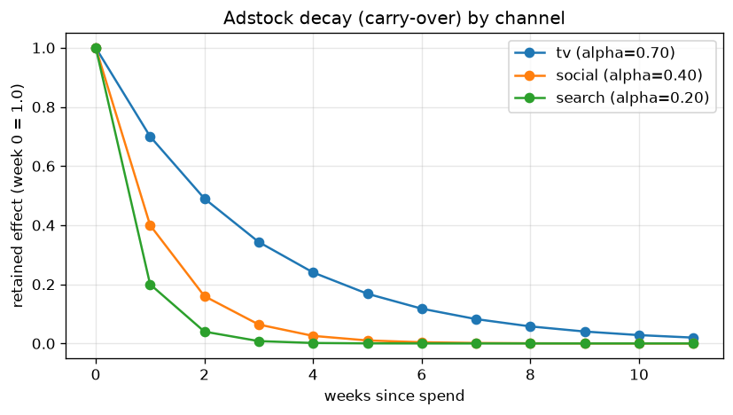
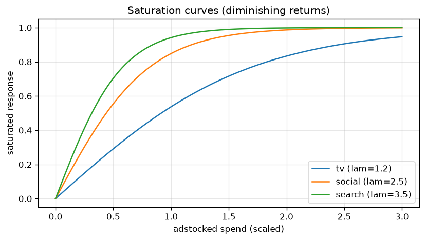

# What is BMMM?

Marketing Mix Modeling (MMM) is a regression-style approach that attributes a
business outcome (here, weekly **sales**) to media spend across channels plus
baseline factors (trend, seasonality, price). The **Bayesian** version places
priors on every parameter and returns full posterior distributions, so every
quantity — a channel's ROI, its carry-over, the optimal budget — comes with
honest uncertainty.

Two non-linear effects make media spend behave unlike ordinary regressors, and
both are first-class in this model.

## Adstock (carry-over)

Advertising keeps working after the week it runs. **Geometric adstock** models
this as an exponentially decaying memory with retention `α ∈ [0, 1)`:

$$
\text{adstock}(x)_t = \frac{\sum_{l=0}^{L-1} \alpha^{l}\, x_{t-l}}{\sum_{l=0}^{L-1} \alpha^{l}}
$$

A large `α` (e.g. TV) spreads each week's spend far into the future; a small `α`
(e.g. search) acts almost immediately.

{ width="640" }

See [`bmmm.data.transforms.geometric_adstock`][bmmm.data.transforms.geometric_adstock].

## Saturation (diminishing returns)

Doubling spend never doubles sales — channels saturate. We use **logistic
saturation** with steepness `λ`:

$$
\text{sat}(x) = \frac{1 - e^{-\lambda x}}{1 + e^{-\lambda x}}
$$

{ width="640" }

See [`bmmm.data.transforms.logistic_saturation`][bmmm.data.transforms.logistic_saturation].

## Putting it together

For each channel the contribution to sales is
`β · sat(adstock(spend))`, and total sales are:

$$
\text{sales}_t = \text{baseline}_t + \text{seasonality}_t + \text{controls}_t
                 + \sum_{c} \beta_c\, \text{sat}\big(\text{adstock}(x_{c,t})\big)
                 + \varepsilon_t
$$

The same equation drives the [synthetic data generator][bmmm.data.generate.generate]
(so we know the ground truth) and the [PyMC-Marketing model][bmmm.model.mmm.build_mmm]
(which we fit and check against it).

## Priors

Priors are kept explicit in [`ModelConfig`][bmmm.config.ModelConfig] rather than
buried in code:

| Parameter | Prior | Rationale |
|---|---|---|
| `adstock_alpha` | `Beta(1, 3)` | favours shorter carry-over a priori |
| `saturation_lam` | `Gamma(μ=2, σ=1)` | positive, moderate steepness |
| `saturation_beta` | `HalfNormal(2)` | non-negative channel effect |
| `intercept` | `Normal(0, 2)` | weakly-informative baseline |

## Why "offline training"?

MCMC sampling takes minutes, which is fine once but unacceptable per web
request. So training happens once via the [CLI](usage-cli.md); the posterior is
saved to `idata.nc` and every downstream consumer (API, dashboard) just reads
it. CI runs a tiny 50-draw fit purely as a "does it still train?" smoke test.
