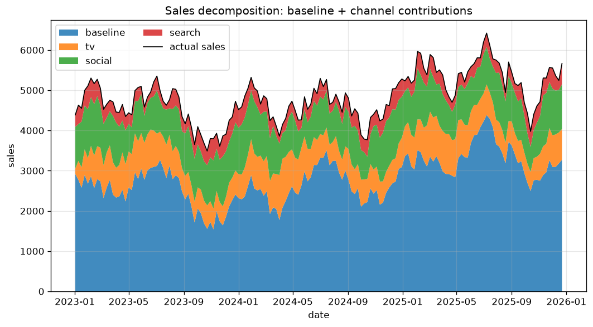
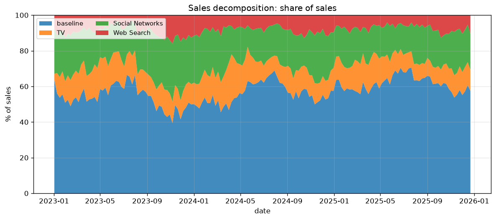
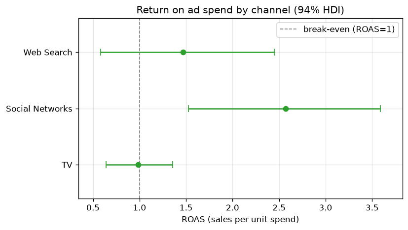

# BMMM: Bayesian Marketing Mix Modeling

This project builds a Marketing Mix Model (MMM) on top of
[PyMC-Marketing](https://www.pymc-marketing.io/) and wraps it in the usual
engineering pieces: a typed config, a command-line tool, a small API, Docker,
CI and an interactive dashboard.

The main idea is **parameter recovery on synthetic data**. We make up a dataset
where we already know the true effect of each marketing channel, fit the model
to it, and check that the model finds those true values back. If it does, we can
trust it on real data where the true values are unknown.

## What an MMM answers

> Given how much we spent on TV, social and search, how much did each channel
> add to sales, and how should we split next quarter's budget?

The model gives a number for each of these questions and also a range around that
number, so you can see how certain the answer is instead of trusting a single
point estimate.

## Results

Trained on 3 years of weekly synthetic data (`configs/default.yaml`, 4000
posterior draws):

| What | Value |
|---|---|
| In-sample R² | 0.93 |
| MAPE | 2.6% |
| Max R-hat | 1.01 |
| Divergences | 0 |
| Adstock recovery | 3 of 3 channels inside the 94% interval |

### Did the model recover the true values?

Red points are the true adstock values we put into the data. Blue points are what
the model estimated, with its uncertainty range. All three true values fall
inside the estimated range.

{ width="640" }

### Where do sales come from?

Each week's sales split into the baseline (everything not driven by ads) plus the
three channels, shown in absolute sales and as a share of sales.

{ width="820" }

{ width="820" }

### How efficient is each channel?

ROAS is sales generated per unit of spend.

{ width="640" }

### How much should we spend?

Looking at the *next* unit of spend, TV is already below break-even while the
other channels still pay off, and the total budget sits a little past its
profit-maximising point. See [budget optimization](budget-optimization.md).

{ width="680" }

## How the pieces connect

```
synthetic data (we know the true effects)
        |
        v
   PyMC-Marketing MMM  --fit-->  saved model (idata.nc)
        |                            |
        |              +-------------+--------------+
        v              v                            v
  parameter recovery   API service            export-dashboard
  (this site)          /predict, /optimize    (compact artifact)
                       (full model, Docker)         |
                                                    v
                                                 dashboard
                                                 (NumPy, no PyMC)
```

Fitting the model takes minutes, so we do it once and save the result. The API
and dashboard never refit. CI runs a tiny 50-draw fit only to check that training
still works.

The dashboard and the API reach the model in two different ways, on purpose. The
**API** loads the full PyMC model and serves it over HTTP for other systems to
integrate with. The **dashboard does not call the API**: to keep the public
Streamlit Cloud deploy light it reads a small precomputed export
(`bmmm export-dashboard`) and recomputes in plain NumPy, so it needs no PyMC, no
92 MB model and no always-on server. See [API service](usage-api.md) for the
trade-off.

## Where to go next

**This project** (what was done and how to run it):

- [Parameter recovery](parameter-recovery.md): the model, the validation and the
  results
- [Budget optimization](budget-optimization.md): splitting a budget and sizing it
- [CLI](usage-cli.md) and [API](usage-api.md): running it
- [API Reference](api/config.md): generated from the code's docstrings

**Theory** (the general ideas):

- [Concepts](concepts.md): adstock, saturation, Bayesian inference, sampling and
  the tools
