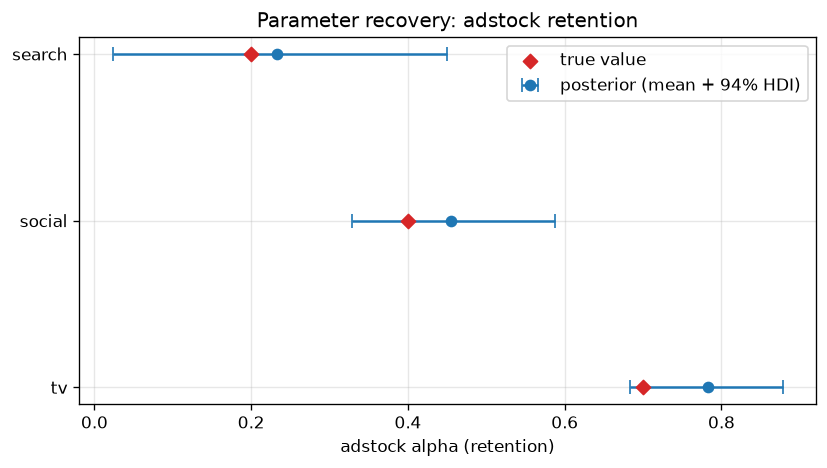
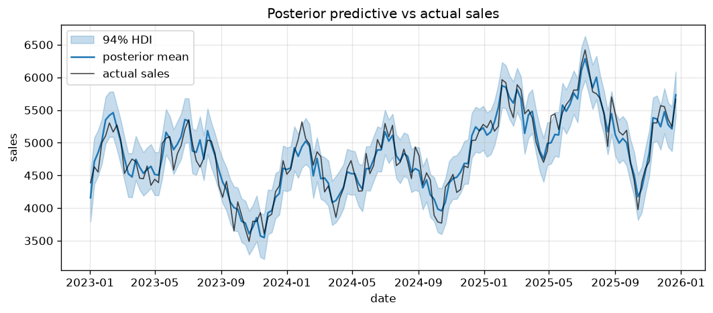

# Parameter recovery

This is the project's central validation idea and the thing that separates it
from a copy-pasted notebook: **prove the model works by recovering parameters we
ourselves planted.**

## The method

1. **Choose ground truth.** In `configs/default.yaml` every channel has a true
   `adstock_alpha`, `saturation_lam` and `beta` (see [`ChannelSpec`][bmmm.config.ChannelSpec]).
2. **Simulate.** [`generate`][bmmm.data.generate.generate] builds 3 years of
   weekly sales from those parameters plus trend, seasonality, a price control
   and noise — using the *same* adstock/saturation math as the model.
3. **Fit.** [`build_mmm`][bmmm.model.mmm.build_mmm] + [`fit_mmm`][bmmm.model.mmm.fit_mmm]
   estimate the posterior with NUTS (`nutpie`).
4. **Compare.** [`recovery_table`][bmmm.model.analysis.recovery_table] checks
   whether each true value lands inside the posterior's 94 % HDI.

## Why adstock α is the cleanest target

Adstock retention is **scale-free**: it doesn't depend on the units of spend or
sales, so the true value and the recovered posterior live on the same `[0, 1)`
axis and can be compared directly. Saturation `λ` and `β`, by contrast, interact
with the model's internal max-abs scaling, so we validate those through their
business-level consequences — contributions and ROAS — instead.

{ width="680" }

## Results

| Channel | True α | Recovered (mean) | 94 % HDI | Inside? |
|---|---|---|---|---|
| tv | 0.70 | 0.78 | [0.68, 0.88] | ✅ |
| social | 0.40 | 0.46 | [0.33, 0.59] | ✅ |
| search | 0.20 | 0.23 | [0.02, 0.45] | ✅ |

All three retentions are recovered inside their credible intervals. Note the
honest detail: `search` has a wide interval — short carry-over plus collinearity
with `social` leaves the data less able to pin it down, exactly what a faithful
Bayesian model *should* report.

## Sampler diagnostics

Recovery only means something if the sampler converged. [`diagnostics`][bmmm.model.analysis.diagnostics]
reports:

- **Max R̂ = 1.01** — chains mixed (target ≈ 1.0)
- **0 divergences** — no pathological geometry
- **Min ESS ≈ 700** — enough effective samples
- **R² = 0.92, MAPE = 2.8 %** — the posterior predictive tracks actual sales

{ width="760" }

## Reproduce it

```bash
uv run bmmm train          # fit and save artifacts/
uv run bmmm evaluate       # prints the recovery table above
```
