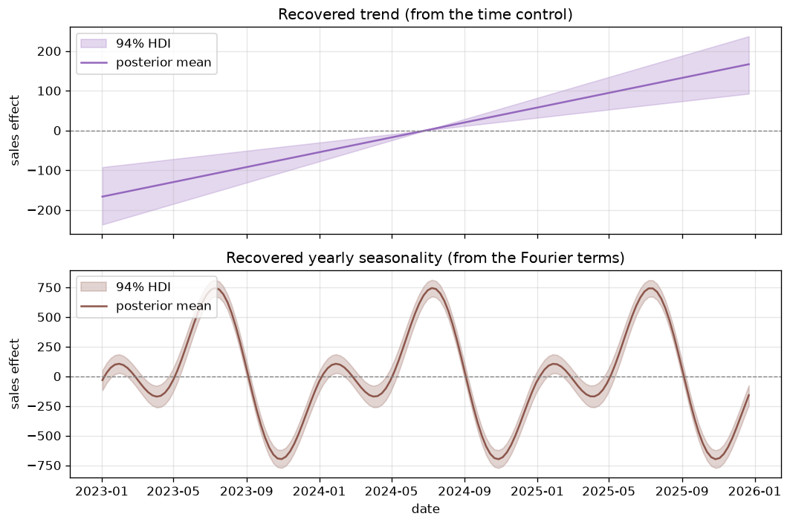
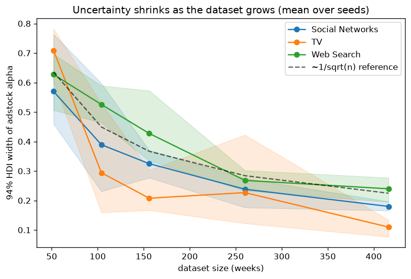

# Parameter recovery

This page describes what this project actually built and the results it produced.
For the underlying ideas, see [Concepts](concepts.md).

## The idea

With real marketing data we never know the true effect of a channel, so we cannot
tell whether the model is right. The fix is to make up data where we *do* know the
true effects, fit the model, and check it finds them back.

## The model in this project

- **Channels:** `tv`, `social`, `search`, each with geometric
  [adstock](concepts.md#adstock-carry-over) and logistic
  [saturation](concepts.md#saturation-diminishing-returns).
- **Controls:** `price` and a standardized `time` index (the trend), plus yearly
  seasonality.
- **Target:** weekly sales over 3 years.
- **Priors:** weakly informative, chosen to match each parameter's valid range
  (see [why](concepts.md#priors)) and kept in [`ModelConfig`][bmmm.config.ModelConfig]:

  | Parameter | Prior |
  |---|---|
  | `adstock_alpha` | `Beta(1, 3)`, naturally between 0 and 1 |
  | `saturation_lam` | `Gamma(mean=2, sd=1)`, positive |
  | `saturation_beta` | `HalfNormal(2)`, non-negative ad effect |
  | `intercept` | `Normal(0, 2)` |
  | `price` / `time` | `Normal(0, ...)`, can go either way |

## The steps

1. **Pick true values.** In `configs/default.yaml` every channel has a true
   `adstock_alpha`, `saturation_lam` and `beta` (see [`ChannelSpec`][bmmm.config.ChannelSpec]).
2. **Build the data.** [`generate`][bmmm.data.generate.generate] makes the weekly
   sales from those values plus trend, seasonality, price and noise, using the same
   adstock and saturation math as the model.
3. **Fit.** [`build_mmm`][bmmm.model.mmm.build_mmm] and [`fit_mmm`][bmmm.model.mmm.fit_mmm]
   estimate the model with NUTS.
4. **Compare.** [`recovery_table`][bmmm.model.analysis.recovery_table] checks
   whether each true value falls inside the 94% credible interval.

We focus on adstock `alpha` because it is scale-free: the true value and the
estimate are on the same 0 to 1 scale and compare directly. The saturation
`lambda` and weight `beta` interact with the model's internal rescaling, so we
check those through their real-world results (contributions and ROAS) instead.

## Results

{ width="680" }

| Channel | True alpha | Estimated (mean) | 94% interval | Inside? |
|---|---|---|---|---|
| tv | 0.70 | 0.70 | 0.58 to 0.82 | yes |
| social | 0.40 | 0.43 | 0.31 to 0.54 | yes |
| search | 0.20 | 0.26 | 0.03 to 0.47 | yes |

All three true values land inside the estimated range. Note that `search` has a
wide range: it has a short carry-over and its spend overlaps with `social`, so the
data cannot pin it down as tightly. The model reports that honestly through the
wider interval, which is the behavior we want.

The fitted model also splits sales into the baseline and each channel, both in
absolute sales and as a share of sales:

{ width="820" }

{ width="820" }

The model also recovers the baseline parts. The trend (from the `time` control)
and the yearly seasonality come back cleanly, each with its credible band:

{ width="760" }

## Did the sampler converge?

Recovery only means something if the fitting worked. We run several independent
chains and check they agree (see [checking the sampler](concepts.md#checking-the-sampler)
for what these mean). [`diagnostics`][bmmm.model.analysis.diagnostics] reports:

- **Max R-hat = 1.01** (chains agree)
- **0 divergences**
- **Min effective sample size around 780**
- **R² = 0.93, MAPE = 2.6%** (predictions track actual sales)

{ width="760" }

## How much data do we need?

The credible intervals above are fairly wide (for example `search` spans about
0.03 to 0.47). That is normal for MMM: a real dataset is two or three years of
weekly data, and at that size the data simply cannot pin every parameter down
tightly. Showing that uncertainty honestly is the whole point of the Bayesian
approach.

To see how it depends on data, the experiment in
`scripts/hdi_vs_dataset_size.py` refits the model on datasets from 1 to 8 years
(averaged over several random seeds) and measures the width of the 94% interval
for each channel's adstock alpha:

{ width="720" }

The width shrinks roughly like `1 / sqrt(n)`, the usual rate for this kind of
estimate: going from 1 year to 3 years helps a lot, and after that the gains slow
down. `Web Search` stays the widest at every size, because its short carry-over
and overlap with `Social Networks` leave less information to separate them.

| dataset | Social Networks | TV | Web Search |
|---|---|---|---|
| 52 weeks | 0.57 | 0.71 | 0.63 |
| 156 weeks | 0.33 | 0.21 | 0.43 |
| 416 weeks | 0.18 | 0.11 | 0.24 |

## Reproduce it

```bash
uv run bmmm train          # fit and save the model
uv run bmmm evaluate       # prints the recovery table above
```
